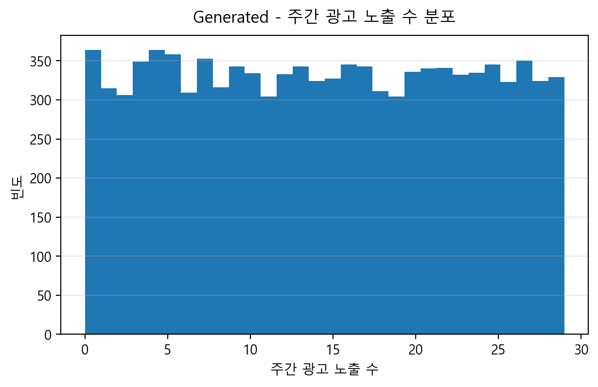
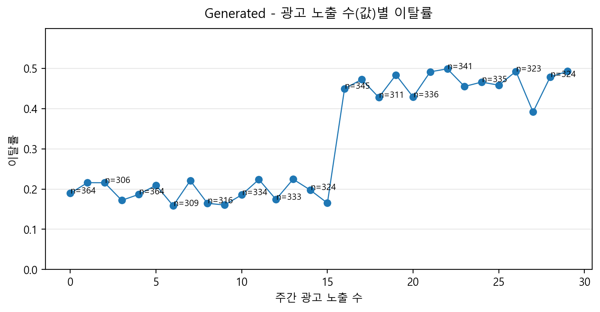
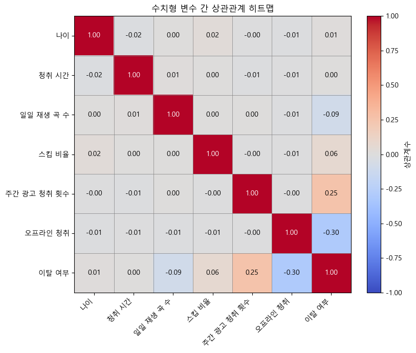

# 🎵 Spotify Churn Insight AI (SKN22-2nd-3Team)

> **스포티파이 사용자 이탈 예측 및 비즈니스 인사이트 제공 대시보드** > 사용자의 행동 패턴을 분석하여 이탈 가능성을 사전에 예측하고, 맞춤형 방어 전략을 제시합니다.

## 📌 프로젝트 개요 (Overview)
이 프로젝트는 음악 스트리밍 서비스 Spotify의 사용자 데이터를 머신러닝(ML)과 딥러닝(DL) 모델로 분석합니다.  
단순한 예측을 넘어, **'누가', '왜' 이탈하는지**를 설명하고 이를 막기 위한 **비즈니스 액션 플랜**을 제안하는 AI 웹 애플리케이션입니다.

## 👥 팀원 및 역할 (Members)
| 이름 | 역할 | 담당 업무 |
| :--- | :--- | :--- |
| **이신재** | 🎨 UI 구현 | Streamlit 웹 대시보드 기획 및 프론트엔드 구현, 시각화 |
| **장완식** | 🧠 모델 학습 | 머신러닝(RandomForest, XGBoost) 및 딥러닝 모델 설계 및 튜닝 |
| **구연미** | 🛠 데이터 전처리 | 결측치/이상치 처리, 파생 변수 생성, 데이터 스케일링 |
| **정세환** | 📊 EDA | 탐색적 데이터 분석, 상관관계 분석 및 주요 특징 도출 |

## 🚀 주요 기능 (Key Features)
1.  **모델 성능 비교 대시보드**: 다양한 AI 모델의 정확도와 F1-Score 비교 분석
2.  **실전 이탈 예측**: 사용자 정보를 입력하면 실시간으로 이탈 확률(%) 예측
3.  **심층 원인 분석**: 레이더 차트와 상세 리포트를 통해 이탈 위험 요인(Risk Factor) 시각화
4.  **비즈니스 전략 가이드**: 예측된 위험도(안전/주의/위험)에 따른 구체적인 마케팅/서비스 개선 전략 제안

## 📂 데이터셋 설명 (Data Dictionary)
이 데이터셋은 Spotify 사용자의 인구통계 정보, 이용 행태, 구독 정보 등을 포함하며, **이탈 여부(`is_churned`)**를 예측하는 것이 핵심 목표입니다.

| 구분 | 컬럼명 (Feature) | 설명 | 데이터 타입 | 비고 |
| :--- | :--- | :--- | :--- | :--- |
| **식별자** | `user_id` | 사용자 고유 ID | String | 모델 학습 시 제외 |
| **유저 정보** | `gender` | 성별 (Male, Female, Other) | Categorical | |
| | `age` | 나이 | Numeric | |
| | `country` | 국가 / 지역 | Categorical | |
| **구독 정보** | `subscription_type` | 구독 요금제 유형 | Categorical | Free, Premium, Family, Student |
| **활동성** | `listening_time` | 하루 평균 청취 시간 (분) | Numeric | 서비스 몰입도 지표 |
| | `songs_played_per_day`| 하루 재생 곡 수 | Numeric | 활동량 지표 |
| | `device_type` | 주 사용 기기 | Categorical | Mobile, Desktop, Web |
| | `offline_listening` | 오프라인 모드 사용 여부 | Binary | 1: 사용, 0: 미사용 (Premium 기능) |
| **만족도/부정** | `skip_rate` | 노래 스킵 비율 (0.0 ~ 1.0) | Numeric | 높을수록 불만족 가능성 높음 |
| | `ads_listened_per_week`| 주간 광고 청취 수 | Numeric | Free 유저의 피로도 측정 지표 |
| **타겟(Target)**| `is_churned` | **이탈 여부** | Binary | **0: 유지 (Active)**<br>**1: 이탈 (Churned)** |

## 🛠 기술 스택 (Tech Stack)
* **Language**: Python 3.9+
* **Web Framework**: Streamlit
* **ML/DL**: Scikit-learn, XGBoost, TensorFlow (Keras)
* **Data Analysis**: Pandas, NumPy
* **Visualization**: Plotly, Matplotlib, Seaborn

## 📁 프로젝트 구조 (Directory Structure)

```
SKN22-2nd-3Team/
├── data/                  # 원본 및 전처리된 데이터
├── models/                # 학습된 모델 (.pkl, .h5) 및 전처리기
├── notebooks/             # 데이터 분석 및 모델 학습 노트북 (ipynb)
├── app.py                 # Streamlit 메인 애플리케이션
└── README.md              # 프로젝트 설명 파일
```

# 📊 Spotify 고객 이탈(Churn) EDA Report

## Executive Summary

본 프로젝트는 Kaggle Spotify 고객 이탈 데이터를 기반으로 EDA를 수행하였다. 

분석 결과, **Origin(원본) 데이터는 주요 변수(요금제/오프라인/광고)에서 이탈률 차이가 작아 학습 신호가 약한 구조**로 관찰되었다. 

반면 **Generated(시뮬레이션) 데이터는 이탈이 특정 조건(광고/요금제/오프라인)에 집중되도록 구성**되어, 임계점(Threshold)·상호작용(Interaction)·비선형 패턴을 활용한 모델 비교 실험에 적합하다. 

---

## 1. 데이터 개요

### 1.1 데이터 출처 및 타깃 정의

* 데이터 출처: Kaggle – *Spotify Dataset for Churn Analysis*
* 원본 데이터 파일명: `spotify_churn_dataset_origin.csv`
* 타깃 변수: `is_churned` (1=이탈, 0=유지)
* 주요 컬럼

  * 사용자 정보: `age`, `gender`, `country`
  * 서비스 이용: `listening_time`, `songs_played_per_day`, `skip_rate`
  * 수익/광고: `subscription_type`, `ads_listened_per_week` 

### 1.2 데이터셋 구성(Origin vs Generated)

본 프로젝트는 2개 데이터셋을 병행한다.

* **Origin**: 제공된 원본 형태(현실 데이터의 약한 신호/한계 파악)
* **Generated**: “이탈이 발생할 법한 가정”을 반영해 패턴을 주입한 시뮬레이션 데이터(모델 실험 목적) 

| 구분        |          규모 |    이탈률 |
| --------- | ----------: | -----: |
| Origin    |  8,000 × 12 | 25.89% |
| Generated | 10,000 × 12 | 31.79% |


  

## 2. 데이터 품질 점검(Generated)

Generated 데이터는 합성 과정(정규분포 기반 생성 변수 포함) 특성상 **비현실 값(음수)** 이 일부 발생할 수 있어 품질 점검을 수행했다. 

* 결측치: 전 컬럼 **0%**
* 음수 값 존재

  * `listening_time < 0`: **18건 (0.18%)**
  * `songs_played_per_day < 0`: **228건 (2.28%)** 


  
  

---

## 3. 전처리 및 모델링 전략

### 3.1 전처리 방향

* 불필요 컬럼 제거: `user_id`
* 범주형 원-핫 인코딩: `gender`, `subscription_type`, `device_type`, `country` 등
* 수치형 스케일링: Standard Scaling
* (Generated 품질 이슈) 음수 값 처리: `listening_time`, `songs_played_per_day` clip 또는 제거 

### 3.2 모델링 관점 시사점

* Origin: 주요 변수에서 이탈률 차이가 작아 “학습 신호 약함”
* Generated: 임계점/상호작용/비선형 패턴이 명확
  → 트리 기반 모델, 비선형 모델, 딥러닝 모델 비교 및 threshold 실험에 적합 

---

## 4. 핵심 패턴 검증(Origin vs Generated)

### 4.1 요금제(subscription_type)별 이탈률

요금제는 “지불 의사/충성도”를 직접 반영하는 핵심 변수이므로, 두 데이터에서 이탈 분리력이 존재하는지 비교했다. 

**Origin(차이 약함)**

* Free: 24.93%
* Premium: 25.06%
* Student: 26.19%
* Family: 27.52% 

→ 요금제만으로 이탈을 가르기 어려운 구조.

**Generated(차이 큼)**

* Free: 46.33% (n=5,942 / 59.4%)
* Student: 26.57% (n=1,020 / 10.2%)
* Premium: 5.10% (n=3,038 / 30.4%) 

→ Generated에서는 요금제가 이탈을 가르는 강한 신호로 동작.


  

---

### 4.2 오프라인 사용(offline_listening) 여부

오프라인 사용은 “서비스 몰입/활용도”로 해석 가능하여 보호 요인(이탈 감소)으로 작동하는지 확인했다. 

**Origin**

* offline=0: 24.93%
* offline=1: 26.21% (차이 미미) 

**Generated**

* offline=0: 45.59% (n=5,012 / 50.1%)
* offline=1: 17.92% (n=4,988 / 49.9%) 

→ Generated에서는 offline이 **이탈 억제(보호 요인)**로 강하게 작동.


  

---

### 4.3 광고 피로(ads_listened_per_week) 임계점(Threshold)

광고는 “점진적 불편”보다 “임계점 이후 급격한 불만 증가”가 더 현실적일 수 있어, ads=15를 기준으로 이탈률이 급변하는지 확인했다. 

**Generated**

* ads ≤ 15: 19.15% (n=5,342 / 53.4%)
* ads ≥ 16: 46.29% (n=4,658 / 46.6%) 

→ 광고가 15회를 넘는 순간 이탈이 급증(Threshold 패턴).

**Origin**

* ads ≤ 15: 25.96%

* ads ≥ 16: 25.60% (차이 거의 없음) 


  
  
  

---

## 5. 상호작용(Interaction): 요금제 × 오프라인(Generated)

Generated에서는 “요금제”와 “오프라인”이 단독 효과뿐 아니라 상호작용으로도 이탈을 크게 흔드는지 확인했다. 

* `Free: offline=0` **66.33%**, `offline=1` **26.26%**
* `Student: offline=0` **46.67%**, `offline=1` **6.47%**
* `Premium: offline=0` **4.78%**, `offline=1` **5.42%** 

→ Free/Student는 offline 여부에 따라 이탈률이 크게 변하며, Premium은 이미 낮아 효과가 제한적. 


  

### 5.1 Free인데 offline=1이 존재하는 예외 구간

일반적으로 Free는 오프라인 청취가 불가능하므로 Free & offline=1 조합은 현실 규칙과 맞지 않는 값(예외 케이스)이다.
그럼에도 해당 집단에서 이탈률이 **26.26%** 로 관측되는 이유는 아래 가설로 설명 가능하다.

가설: “무료 체험/프로모션 후 만료 이탈”

과거 Premium 체험 기간 동안 오프라인 기능을 사용했으나,
체험 종료 후 현재 상태가 Free로 전환되어 구독 유형은 Free로 기록되고,
이후 만료 시점/전환 거부로 이탈이 발생했을 수 있음

이 경우 offline_listening은 “Free에서도 가능한 기능”이 아니라 데이터 로그 상 과거 Premium 경험(이력)의 흔적으로 해석된다.

---

## 6. 상관관계 분석(Correlation)

수치형 변수 간 상관관계를 통해 중복/구조적 관계를 점검했으며, `user_id`는 식별자이므로 제외했다. 

핵심 인사이트:

1. `ads_listened_per_week` ↔ `offline_listening` 사이에 구조적 관계 가능

* offline은 Premium 기능 성격, ads는 Free 광고 노출 성격
  → 독립 행동 신호라기보다 **구독 구조의 결과로 함께 결정**될 수 있음 

2. `offline_listening` ↔ `is_churned`에서 음의 상관(≈ -0.30) 관찰
   → 오프라인 사용이 증가할수록 이탈이 감소하는 방향(보호 요인) 


  

---

## 7. 결론

Origin 데이터는 변수-이탈 관계가 약해 예측 신호가 제한적이었고, Generated 데이터는 요금제·오프라인·광고 임계점에서 이탈이 뚜렷이 분리되는 구조를 보였다.

따라서 본 프로젝트는 **Origin으로 현실 데이터의 한계를 확인**하고, **Generated로 모델 구조별 학습 특성/임계값 조정/상호작용 반영 능력을 비교**하는 전략으로 진행한다.

---
