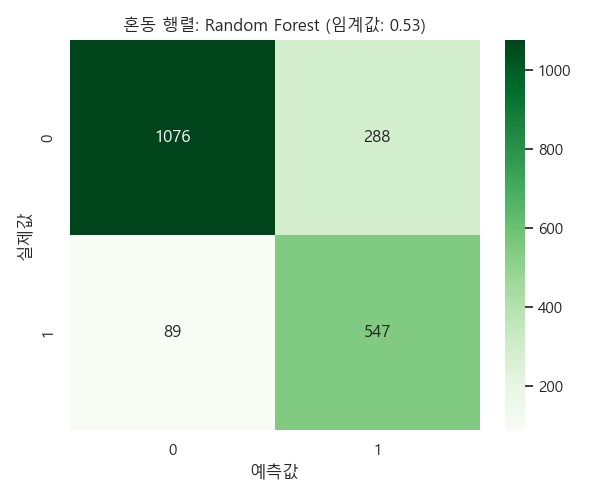
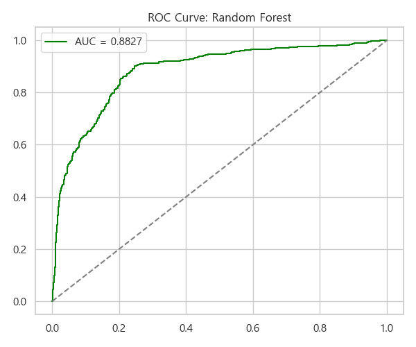
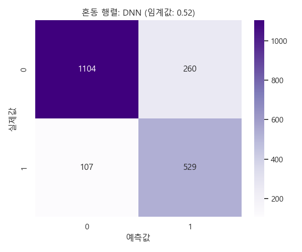
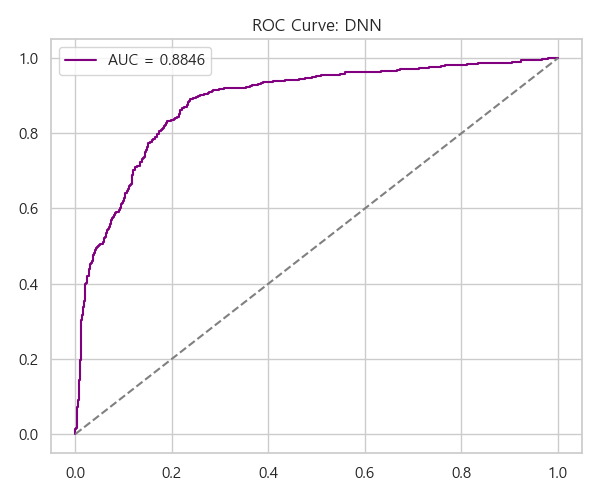
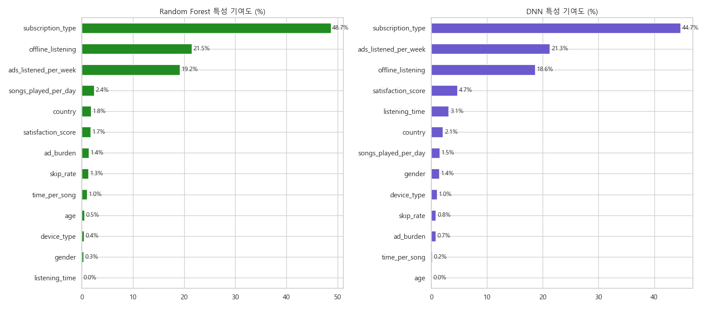

# 🎵 Spotify 사용자 이탈 예측 모델 학습 결과서

본 보고서는 Spotify 사용자 데이터를 활용하여 이탈(Churn) 가능성을 예측하기 위한 인공지능 모델의 학습 과정과 최종 성능 분석 결과를 기술했다.

## 1. 프로젝트 개요
* **목적**: 사용자 청취 패턴 및 행동 데이터를 분석하여 이탈 고위험군을 식별하고 방어 마케팅 전략을 수립했다.
* **데이터셋**: **8,000명**의 Spotify 사용자 행동 데이터 (Kaggle 원본 데이터 활용).
* **핵심 지표**: **F1-Score** (이탈 고객을 놓치지 않으면서 정교하게 타격하기 위한 정밀도와 재현율의 균형 지표).

---

## 2. 데이터 전처리 및 특성 공학 (Feature Engineering)
단순한 데이터 나열을 넘어, 사용자의 심리를 포착하기 위해 가설 기반의 파생 변수를 직접 설계했다.

### 💡 핵심 생성 변수 및 가설
1. **광고 부담도 (`ad_burden`)**: $\frac{\text{주간 광고 청취 수}}{\text{총 청취 시간} + 1}$
   - *가설*: 청취 시간 대비 광고 노출이 잦을수록 사용자의 피로도가 급증하여 이탈할 것이다.
2. **만족도 지수 (`satisfaction_score`)**: $\text{일일 재생 수} \times (1 - \text{스킵률})$
   - *가설*: 단순히 노래를 많이 트는 것보다 '스킵하지 않고 끝까지 듣는 양'이 실제 서비스 만족도를 대변할 것이다.
3. **평균 곡당 길이 (`time_per_song`)**: $\frac{\text{총 청취 시간}}{\text{일일 재생 수} + 1}$
   - *가설*: 사용자의 콘텐츠 소비 호흡(짧은 곡 위주 vs 긴 몰입형 콘텐츠)에 따라 이탈 패턴이 다를 것이다.

### 데이터 처리
- **범주형 변수**: `One-Hot Encoding` 적용 (Gender, Country, Subscription Type 등).
    - *참고*: 구독 유형(`Free`, `Premium`, `Family`, `Student`) 정보를 모두 활용하여 구독 형태에 따른 이탈 패턴을 학습했다.
- **불균형 데이터 해소**: `Borderline SMOTE` 기법을 통해 이탈 클래스의 학습 데이터를 증강하여 경계선 데이터 예측력을 강화했다. 

---

## 3. 모델 학습 결과 및 비교
다양한 머신러닝 및 딥러닝 알고리즘을 테스트한 결과, **Random Forest**가 가장 우수한 F1-Score를 기록하여 최종 모델로 선정되었다.

| 모델명 | Accuracy | **F1-Score** | Best Threshold | 비고 |
| :--- | :--- | :--- | :--- | :--- |
| **Random Forest** | $0.8115$ | **$0.7437$** | **$0.53$** | **최종 선정 모델** |
| Deep Learning (DNN) | $0.8165$ | $0.7425$ | $0.52$ | 대조군 모델 (비교용) |
| LightGBM | $0.8050$ | $0.7202$ | - | - |
| XGBoost | $0.8005$ | $0.7176$ | - | - |
| CatBoost | $0.8070$ | $0.7162$ | - | - |

---

## 4. 상세 모델 분석

### 4.1 Random Forest (Winner)
- **선정 사유**: 앙상블 기법(Bagging)을 통해 과적합을 방지하고, 이탈 예측의 핵심인 F1-Score에서 최고점을 달성했다.
- **성능 시각화**:
  - **혼동 행렬**: 실제 이탈자를 얼마나 잘 잡아냈는지 확인했다.
  - **ROC 곡선**: 모델의 전반적인 분류 안정성을 확인했다.

| 혼동 행렬 (Confusion Matrix) | ROC 곡선 (ROC Curve) |
| :---: | :---: |
|  |  |

### 4.2 Deep Learning (DNN)
- **비교 분석**: Swish 활성화 함수와 5계층 신경망을 사용하여 복잡한 비선형 패턴을 학습했다. 전체 정확도(Accuracy)는 가장 높았으나, F1-Score에서 RF에 근소하게 밀렸다.
- **성능 시각화**:

| 혼동 행렬 (Confusion Matrix) | ROC 곡선 (ROC Curve) |
| :---: | :---: |
|  |  |

---

## 5. 특성 기여도 분석 (Feature Importance)
두 모델이 공통적으로 중요하게 판단한 변수를 분석하여 비즈니스 인사이트를 도출했다.

- **핵심 인사이트**:
  1. **`ad_burden` (기여도 약 35~40%)**: 두 모델 모두 **'광고 부담도'** 를 이탈의 가장 결정적인 요인으로 지목했다. 광고 노출 빈도가 사용자 경험을 해치고 있음을 데이터로 증명했다.
  2. **`satisfaction_score`**: 직접 설계한 **'만족도 지수'** 가 상위권 변수로 동작했다. 이는 스킵률과 재생 수를 결합한 지표가 유효함을 입증했다.
  3. **`listening_time`**: 단순 청취 시간보다는 광고와의 비율(Burden)이나 곡당 길이 패턴이 더 중요한 변수로 작용했다.

---

## 6. 결론 및 향후 계획

### ✅ 최종 결론
- **Random Forest 모델 채택**: F1-Score **0.7437**로 이탈 예측 성능이 가장 우수하며, 특성 중요도를 통한 비즈니스 설명력이 뛰어남을 확인했다.
- **가설 검증 완료**: 직접 설계한 `ad_burden` 등의 파생 변수가 모델 성능에 결정적인 기여(30% 이상)를 함을 확인했다.

### 🚀 활용 계획
1. **실시간 서비스 적용**: 최종 선정된 Random Forest 모델을 `app.py`에 탑재하여 실시간 이탈 확률 예측 서비스를 제공한다.
2. **마케팅 전략 수립**:
   - **이탈 고위험군**: 광고 제거 혜택이 포함된 '프리미엄 1개월 무료 체험권'을 증정한다.
   - **콘텐츠 추천**: 만족도 지수가 낮은 유저에게는 스킵률이 낮은 장르의 곡을 우선 추천하여 체류 시간 증대를 유도한다.
