# 🎵 Spotify Churn Insight AI (SKN22-2nd-3Team)

> **스포티파이 사용자 이탈 예측 및 비즈니스 인사이트 제공 대시보드**  
> 사용자의 행동 패턴을 분석하여 이탈 가능성을 사전에 예측하고, 맞춤형 방어 전략을 제시합니다.

## 📌 프로젝트 개요 (Overview)
이 프로젝트는 음악 스트리밍 서비스 Spotify의 사용자 데이터를 머신러닝(ML)과 딥러닝(DL) 모델로 분석합니다.  
단순한 예측을 넘어, **'누가', '왜' 이탈하는지**를 설명하고 이를 막기 위한 **비즈니스 액션 플랜**을 제안하는 AI 웹 애플리케이션입니다.

## 👥 팀원 및 역할 (Members)
| 이름 | 역할 | 담당 업무 |
| :--- | :--- | :--- |
| **이신재** | 🎨 UI 구현 | Streamlit 웹 대시보드 기획 및 프론트엔드 구현, 시각화 |
| **장완식** | 🧠 모델 학습 | 머신러닝(RandomForest, XGBoost) 및 딥러닝 모델 설계 및 튜닝 |
| **구연미** | 🛠 데이터 전처리 | 결측치/이상치 처리, 파생 변수 생성, 데이터 스케일링 |
| **정세환** | 📊 EDA | 탐색적 데이터 분석, 상관관계 분석 및 주요 특징 도출 |

## 🚀 주요 기능 (Key Features)
1.  **모델 성능 비교 대시보드**: 다양한 AI 모델의 정확도와 F1-Score 비교 분석
2.  **실전 이탈 예측**: 사용자 정보를 입력하면 실시간으로 이탈 확률(%) 예측
3.  **심층 원인 분석**: 레이더 차트와 상세 리포트를 통해 이탈 위험 요인(Risk Factor) 시각화
4.  **비즈니스 전략 가이드**: 예측된 위험도(안전/주의/위험)에 따른 구체적인 마케팅/서비스 개선 전략 제안

## 📂 데이터셋 설명 (Data Dictionary)
이 데이터셋은 Spotify 사용자의 인구통계 정보, 이용 행태, 구독 정보 등을 포함하며, **이탈 여부(`is_churned`)**를 예측하는 것이 핵심 목표입니다.

| 구분 | 컬럼명 (Feature) | 설명 | 데이터 타입 | 비고 |
| :--- | :--- | :--- | :--- | :--- |
| **식별자** | `user_id` | 사용자 고유 ID | String | 모델 학습 시 제외 |
| **유저 정보** | `gender` | 성별 (Male, Female, Other) | Categorical | |
| | `age` | 나이 | Numeric | |
| | `country` | 국가 / 지역 | Categorical | |
| **구독 정보** | `subscription_type` | 구독 요금제 유형 | Categorical | Free, Premium, Family, Student |
| **활동성** | `listening_time` | 하루 평균 청취 시간 (분) | Numeric | 서비스 몰입도 지표 |
| | `songs_played_per_day`| 하루 재생 곡 수 | Numeric | 활동량 지표 |
| | `device_type` | 주 사용 기기 | Categorical | Mobile, Desktop, Web |
| | `offline_listening` | 오프라인 모드 사용 여부 | Binary | 1: 사용, 0: 미사용 (Premium 기능) |
| **만족도/부정** | `skip_rate` | 노래 스킵 비율 (0.0 ~ 1.0) | Numeric | 높을수록 불만족 가능성 높음 |
| | `ads_listened_per_week`| 주간 광고 청취 수 | Numeric | Free 유저의 피로도 측정 지표 |
| **타겟(Target)**| `is_churned` | **이탈 여부** | Binary | **0: 유지 (Active)**<br>**1: 이탈 (Churned)** |

---

# 📊 Spotify 고객 이탈(Churn) EDA Report

## Executive Summary
본 프로젝트는 Kaggle Spotify 고객 이탈 데이터를 기반으로 EDA를 수행하였습니다.
분석 결과, **Origin(원본) 데이터는 주요 변수(요금제/오프라인/광고)에서 이탈률 차이가 작아 학습 신호가 약한 구조**로 관찰되었습니다.
반면 **Generated(시뮬레이션) 데이터는 이탈이 특정 조건(광고/요금제/오프라인)에 집중되도록 구성**되어, 임계점(Threshold)·상호작용(Interaction)·비선형 패턴을 활용한 모델 비교 실험에 적합합니다.

## 1. 데이터 개요
### 1.1 데이터 출처 및 타깃 정의
* 데이터 출처: [Kaggle – Spotify Dataset for Churn Analysis](https://www.kaggle.com/datasets/nabihazahid/spotify-dataset-for-churn-analysis/)
* 타깃 변수: `is_churned` (1=이탈, 0=유지)
* 주요 컬럼: 사용자 정보(나이, 성별 등), 서비스 이용(청취시간, 재생 수 등), 수익/광고(요금제, 광고청취)

### 1.2 데이터셋 구성(Origin vs Generated)
본 프로젝트는 2개 데이터셋을 병행합니다.
* **Origin**: 제공된 원본 형태 (현실 데이터의 약한 신호/한계 파악)
* **Generated**: "이탈이 발생할 법한 가정"을 반영해 패턴을 주입한 시뮬레이션 데이터 (모델 실험 목적)

| 구분 | 규모 | 이탈률 |
| :--- | :--- | :--- |
| Origin | 8,000 × 12 | 25.89% |
| Generated | 10,000 × 12 | 31.79% |

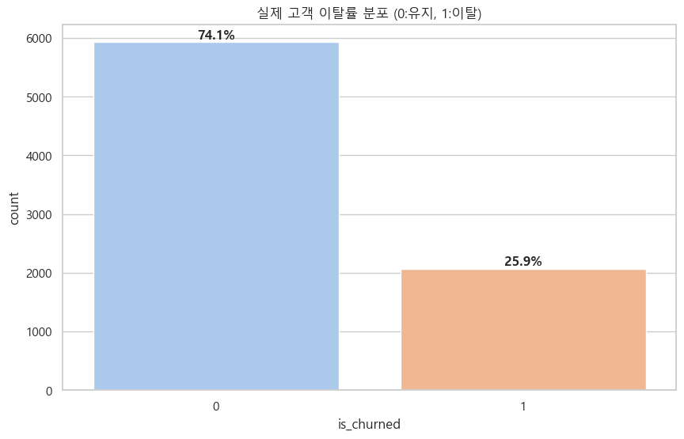

## 2. 데이터 품질 점검(Generated)
Generated 데이터는 합성 과정 특성상 **비현실 값(음수)** 이 일부 발생하여 전처리 과정에서 처리하였습니다.
* 결측치: 0%
* 음수 값: `listening_time`(0.18%), `songs_played_per_day`(2.28%) -> **전처리 시 제거/보정**

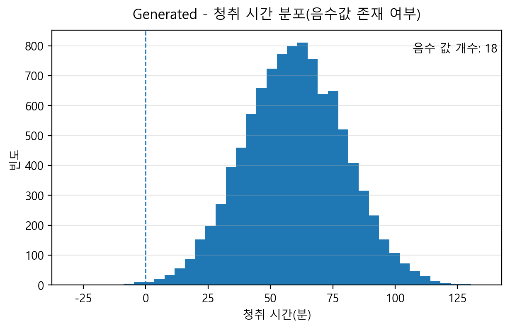
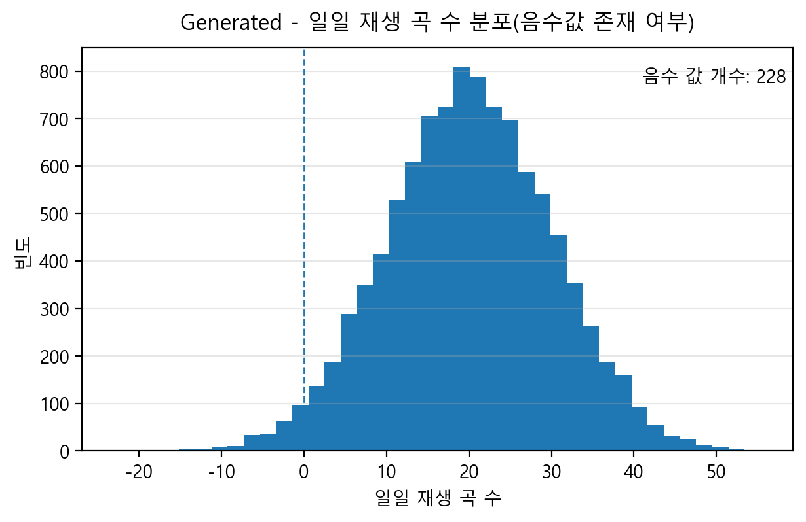

## 3. 핵심 패턴 검증 (Insights)
### 3.1 요금제(subscription_type)별 이탈률
* **Origin**: 요금제별 이탈률 차이 미미 (약 25% 내외)
* **Generated**: **Free(46%)** > Student(26%) > Premium(5%) 순으로 뚜렷한 차이 보임.
  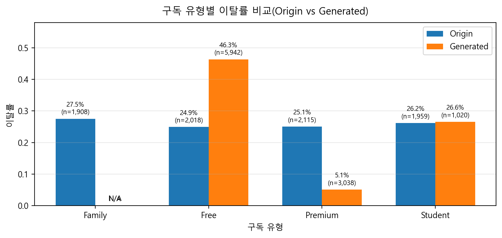

### 3.2 오프라인 사용(offline_listening) 여부
* **Generated**: 오프라인 미사용(45.59%) vs 사용(17.92%). **오프라인 기능 사용이 강력한 이탈 방지(Lock-in) 효과**를 가짐.
  

### 3.3 광고 피로(ads_listened_per_week) 임계점
* **Generated**: 주간 광고 **15회 이상** 청취 시 이탈률 급증 (Threshold 패턴).
  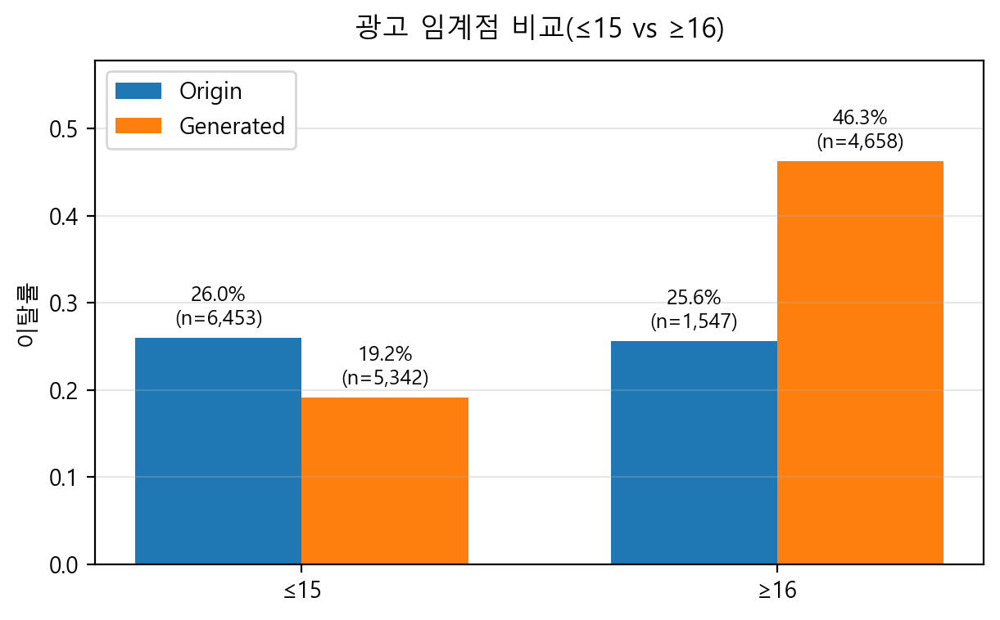

### 3.4 상호작용: 요금제 × 오프라인
* `Free` 사용자 중 오프라인 모드를 사용하지 못함에도 사용하는 것으로 표기된(과거 체험 기록 추정) 케이스에서 이탈률이 낮아지는 현상 발견 -> 복합적 행동 패턴 분석 필요.
  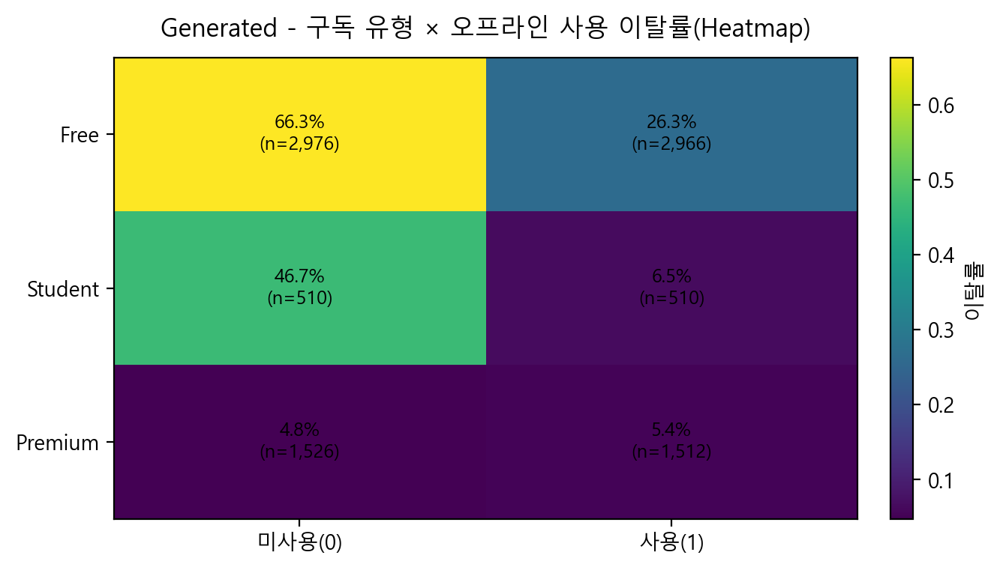

---

# 🧠 모델 학습 및 성능 (Training Report)

## 1. 데이터 전처리 및 특성 공학 (Feature Engineering)
### 💡 핵심 생성 변수 (Derived Features)
사용자의 심리를 포착하기 위해 가설 기반의 파생 변수를 설계했습니다.
1. **광고 부담도 (`ad_burden`)**: $\frac{\text{주간 광고 청취 수}}{\text{총 청취 시간} + 1}$
   - *가설*: 청취 시간 대비 광고 노출이 잦을수록 피로도 급증 → 이탈 유발
2. **만족도 지수 (`satisfaction_score`)**: $\text{일일 재생 수} \times (1 - \text{스킵률})$
   - *가설*: 노래를 많이 듣더라도 스킵이 적어야 진정한 만족 → 이탈 방지
3. **평균 곡당 길이 (`time_per_song`)**: $\frac{\text{총 청취 시간}}{\text{일일 재생 수} + 1}$

### 데이터 처리
- **범주형 변수**: One-Hot Encoding (구독 유형 등)
- **불균형 해소**: **Borderline SMOTE** 기법 적용 (이탈 클래스 증강)

## 2. 모델 성능 비교 결과
다양한 알고리즘(RandomForest, XGBoost, LightGBM, CatBoost, DNN) 성능 비교 결과, **Random Forest**가 가장 우수한 F1-Score를 기록하여 최종 모델로 선정되었습니다.

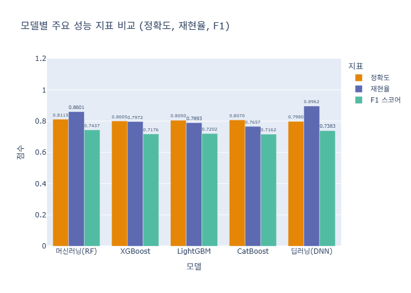

| 모델명 | Accuracy | **F1-Score** | Best Threshold | 비고 |
| :--- | :--- | :--- | :--- | :--- |
| **Random Forest** | **0.8115** | **0.7437** | **0.53** | **최종 선정** |
| Deep Learning (DNN) | 0.7980 | 0.7383 | 0.59 | High Recall (0.896) |
| LightGBM | 0.8050 | 0.7202 | - | |
| XGBoost | 0.8005 | 0.7176 | - | |

## 3. 상세 모델 분석
### 3.1 Random Forest (Final Model)
- **선정 사유**: Bagging 앙상블을 통한 안정적인 예측력 및 최고 F1-Score 달성.
- **성능 시각화**:
| 혼동 행렬 (Confusion Matrix) | ROC 곡선 | PR 곡선 |
| :---: | :---: | :---: |
|  | 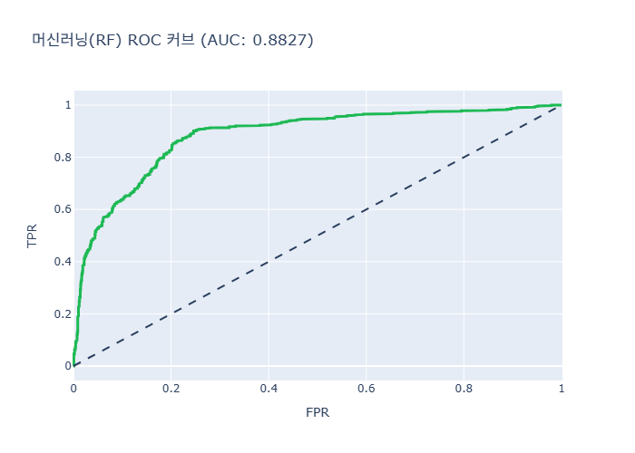 |  |

### 3.2 Feature Importance (특성 중요도)
모델이 이탈을 판단하는 데 가장 중요하게 본 변수는 **`ad_burden` (광고 부담도)** 와 **`satisfaction_score` (만족도 지수)** 입니다.
이는 우리가 세운 가설(광고 피로도와 스킵 없는 청취가 중요하다)이 머신러닝 모델에서도 입증되었음을 의미합니다.

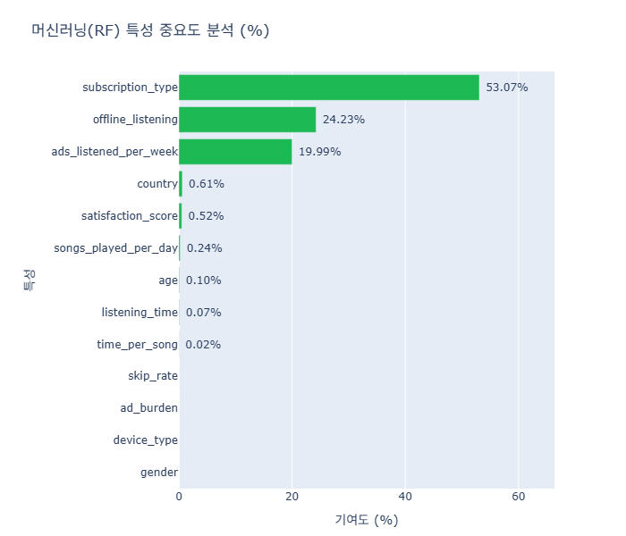

## 6. 결론 및 활용 계획
- **결론**: F1-Score 0.74의 Random Forest 모델을 기반으로 이탈 고위험군을 조기 탐지 가능.
- **활용**:
  1. **실시간 서비스**: Streamlit 앱에 탑재하여 실시간 예측 제공.
  2. **마케팅 액션**: 이탈 위험군(High Risk)에게 **"광고 없는 프리미엄 체험권"** 제공 및 만족도 낮은 유저에게 **"취향 저격 플레이리스트"** 추천.

---

## 🛠 기술 스택 (Tech Stack)
* **Language**: Python 3.9+
* **Web Framework**: Streamlit
* **ML/DL**: Scikit-learn, XGBoost, Pytorch
* **Sampling**: Imbalanced-learn (BorderlineSMOTE)
* **Data Analysis**: Pandas, NumPy
* **Visualization**: Plotly, Matplotlib, Seaborn

## 📁 프로젝트 구조 (Directory Structure)

```
SKN22-2nd-3Team/
├── data/                  # 원본 및 전처리된 데이터
├── 03_trained_model/      # 학습된 모델 (.pkl, .onnx) 및 평가 지표
├── notebooks/             # 데이터 분석 및 모델 학습 노트북 (ipynb)
├── EDA/                   # 팀원별 탐색적 데이터 분석 (EDA)
├── app/                   # Streamlit 애플리케이션 소스
│   ├── Home.py            # 메인 홈 화면
│   └── pages/             # 메뉴별 상세 페이지
├── 01_preprocessing_report/ # 데이터 전처리 및 EDA 리포트
├── 02_training_report/      # 모델 학습 결과 리포트
└── README.md              # 프로젝트 메인 설명 파일 (본 파일)
```
## 🚀 앱 시연

---
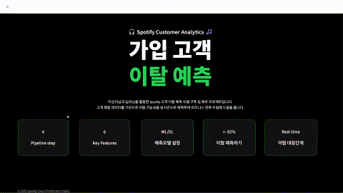
---
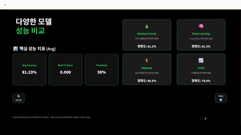
---
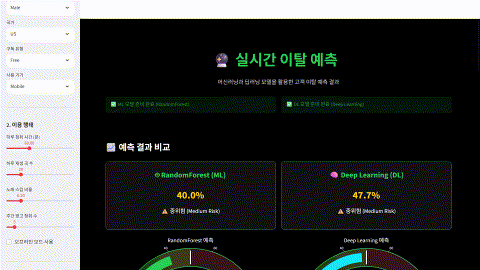
---
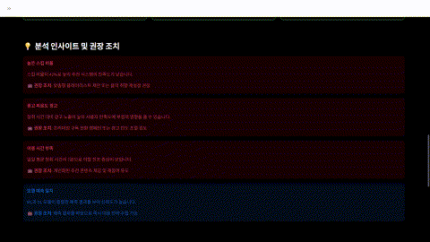
